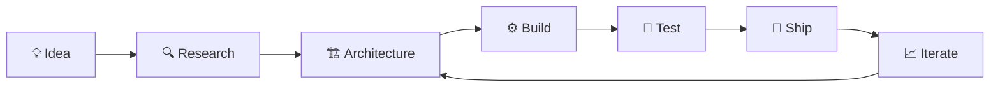

<div align="center">

# `SHUBHAM AGARWAL`

### Full-Stack Developer · Builder · Problem Solver


<br/>

<a href="https://github.com/ShubhamAg01">

</a>
<a href="https://github.com/ShubhamAg01">

</a>

</div>

---

## `> whoami`

```text
Shubham Agarwal
──────────────────────────────────────────────

Role       → Full-Stack Developer
Focus      → Web • Backend • SaaS • AI
Stack      → MERN / TypeScript / Python
Currently  → Building + learning + shipping
Mindset    → Understand it. Build it. Break it. Improve it.
```

I enjoy taking an idea from **“what if?” → architecture → code → product**.

My interests sit at the intersection of **full-stack development, backend engineering, scalable systems, AI-powered tools, and product design**.

I'm less interested in simply following tutorials and more interested in understanding **why things work under the hood**.

---

## `01 / CURRENTLY BUILDING`

### 🔗 Ziplink

> **A modern link management platform.**

A product-focused project exploring link management, QR generation, authentication, APIs, and scalable backend architecture.

**Focus:** `Product Engineering` · `Backend` · `SaaS`

---

### 🎮 Gaming Community Platform

> **A social platform built around gamers.**

A gamified gaming community combining communities, finding teammates, gaming news, collectibles, badges, XP, levels, and hidden experiences.

The goal isn't to build *another forum* — it's to make the platform itself feel like a game.

**Focus:** `Community` · `Gamification` · `Social` · `Gaming`

---

### 🤖 AI Developer Team

> **Exploring AI-native software development.**

An experimental platform investigating how AI agents can collaborate with developers across different stages of the software-development lifecycle.

**Focus:** `AI` · `Agents` · `Developer Tools` · `Automation`

---

### 📚 TriApt

> **Placement preparation, redesigned.**

A platform for practicing aptitude, reasoning, programming concepts, technical interviews, HR interviews, mock tests, and interview simulations.

**Focus:** `EdTech` · `React` · `Interactive UX`

---

## `02 / TECH STACK`

<div align="center">

### Languages


### Frontend


### Backend


### Database / Infrastructure


### Tools


</div>

---

## `03 / ENGINEERING INTERESTS`

```text
┌────────────────────────────────────────────────────┐
│                                                    │
│  ▸ Full-Stack Architecture                         │
│  ▸ Backend Engineering                             │
│  ▸ REST APIs & Service Design                      │
│  ▸ Database Architecture                            │
│  ▸ Caching & Performance                           │
│  ▸ System Design                                   │
│  ▸ AI Developer Tools                              │
│  ▸ SaaS Architecture                               │
│  ▸ Developer Experience                            │
│  ▸ Data Structures & Algorithms                    │
│                                                    │
└────────────────────────────────────────────────────┘
```

---

## `04 / HOW I BUILD`



I like working feature-by-feature:

**Understand → Design → Implement → Test → Ship → Improve**

---

## `05 / GITHUB`

<div align="center">


<br/><br/>


</div>

---

## `06 / CONTRIBUTION GRAPH`

<div align="center">


</div>

---

## `07 / CURRENT MISSION`

```diff
  2026
  ─────────────────────────────────────────────

+ Build products people actually want to use
+ Become stronger at backend engineering
+ Go deeper into system design
+ Understand distributed systems
+ Build better AI-powered developer tools
+ Solve harder DSA problems
+ Ship more. Talk less.
```

---

## `08 / BEYOND CODE`

```text
Gaming          🎮
Manga           📖
Product Ideas   💡
Open Source     🛠️
System Design   🏗️
AI              🤖
```

I like exploring ideas outside my immediate stack because good products usually come from combining **different domains and perspectives**.

---

## `09 / LET'S BUILD`

<div align="center">

If you're working on something interesting in

**AI · SaaS · Web · Developer Tools · Gaming · Open Source**

I'd love to hear about it.

<br/>

<a href="https://github.com/ShubhamAg01">

</a>

<a href="https://www.linkedin.com/">

</a>

<br/><br/>


<br/><br/>

### `BUILD SOMETHING WORTH REMEMBERING.`

</div>
